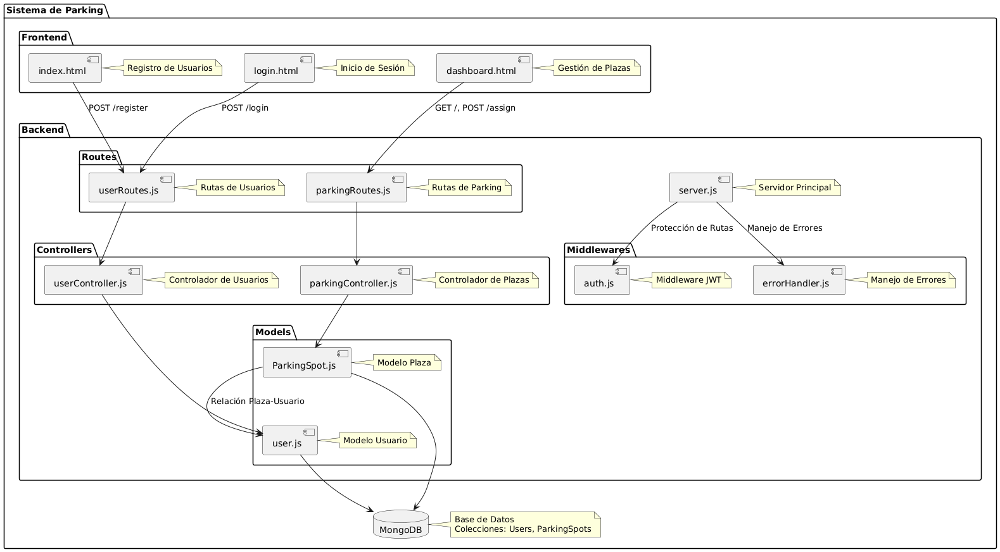

# Sistema de Gestión de Parking 🚗

## **Descripción del Proyecto**
Este proyecto implementa un sistema de gestión de plazas de parking, cumpliendo con los requisitos de la **Práctica PW1**. Permite la autenticación de usuarios, la gestión de plazas (asignación, listado y creación), y la búsqueda de plazas mediante un filtro. La implementación utiliza tecnologías modernas y sigue buenas prácticas en arquitectura y desarrollo web.

---

## **Características Principales**
1. **Autenticación de Usuarios**  
   - Registro de usuarios con validación de contraseña.  
   - Login mediante JWT (JSON Web Tokens).  
   - Protección de rutas mediante middleware.

2. **Gestión de Plazas de Parking**  
   - Creación de nuevas plazas.  
   - Listado de todas las plazas existentes.  
   - Asignación de plazas a usuarios autenticados.  
   - Filtro para buscar plazas por número.

3. **Base de Datos**  
   - Colección de usuarios autenticados.  
   - Colección de plazas de parking.  
   - Relación entre ambas colecciones: una plaza se asigna a un usuario.  

---

## **Tecnologías Utilizadas**
- **Backend**  
  - Node.js  
  - Express.js  
  - MongoDB (a través de Mongoose)  
  - JWT (JSON Web Token)  
  - Bcrypt.js (para hashear contraseñas)  

- **Frontend**  
  - HTML5  
  - CSS (con Tailwind CSS)  
  - JavaScript Vanilla  

- **Herramientas de Desarrollo**  
  - Visual Studio Code  
  - Postman (para pruebas de API)  
  - Git y GitHub (control de versiones)  

---

## Estructura del Proyecto

La estructura del proyecto se organiza de la siguiente manera:

**ProyectoParking/**
- **backend/** _(Contiene toda la lógica del servidor y la API)_
  - **config/** _(Configuración del proyecto)_
    - `db.js` - Configuración de la conexión a la base de datos MongoDB.
  - **controllers/** _(Controladores para manejar la lógica de negocio)_
    - `parkingController.js` - Controlador para la gestión de plazas de parking.
    - `userController.js` - Controlador para la autenticación de usuarios (registro/login).
  - **middlewares/** _(Middlewares para validaciones y seguridad)_
    - `auth.js` - Middleware para verificar la autenticación con JWT.
    - `errorHandler.js` - Middleware para manejar errores globales.
  - **models/** _(Modelos de la base de datos MongoDB)_
    - `ParkingSpot.js` - Modelo de las plazas de parking.
    - `user.js` - Modelo de los usuarios.
  - **routes/** _(Rutas de la API)_
    - `parkingRoutes.js` - Rutas relacionadas con la gestión de plazas de parking.
    - `userRoutes.js` - Rutas relacionadas con la autenticación de usuarios.
  - `.env` - Variables de entorno (MongoDB URI, JWT Secret).
  - `package.json` - Archivo con dependencias y scripts del backend.
  - `package-lock.json` - Archivo generado para mantener consistencia de dependencias.
  - `server.js` - Archivo principal del servidor con configuración Express.
  - `node_modules/` - Dependencias instaladas para el backend.

- **frontend/** _(Contiene la interfaz de usuario para el cliente)_
  - **scripts/** _(Archivos JavaScript para la lógica del cliente)_
    - `dashboard.js` - Lógica para la gestión de plazas en el frontend.
    - `login.js` - Lógica para el inicio de sesión.
    - `register.js` - Lógica para registrar nuevos usuarios.
  - **styles/** _(Archivos de estilos CSS)_
    - `custom.css` - Estilos personalizados para el proyecto.
    - `tailwind.css` - Configuración de estilos usando Tailwind CSS.
  - `dashboard.html` - Página principal para la gestión de plazas.
  - `index.html` - Página de registro de usuarios.
  - `login.html` - Página de inicio de sesión.
  - `tailwind.config.js` - Configuración específica para Tailwind CSS.
  - `package.json` - Archivo con dependencias y scripts del frontend.
  - `package-lock.json` - Archivo generado para dependencias.
  - `node_modules/` - Dependencias instaladas para el frontend.

- **Archivos sueltos/** _(Documentación y recursos del proyecto)_
  - `diagrama.png` - Imagen del diagrama de arquitectura.
  - `PlanificacionProyecto.pdf` - Documento con la planificación del proyecto.
  - `README.md` - Documentación completa del proyecto (este archivo).

## Diagrama de Arquitectura

## **Explicación de la Implementación**

1. **Autenticación y Seguridad**  
   - Se utiliza **JWT** (JSON Web Token) para autenticar a los usuarios.  
   - Al iniciar sesión, se genera un token que contiene el **ID del usuario** y su **nombre de usuario**.
   - Este token se envía al cliente y se almacena en el **localStorage**.
   - El middleware `auth.js` verifica la validez del token y permite proteger rutas que requieren autenticación.

2. **Gestión de Plazas**  
   - El servidor utiliza **Express** para gestionar las solicitudes HTTP.
   - **Controladores**:
     - `createSpot`: Crea nuevas plazas si no existen.
     - `listSpots`: Devuelve todas las plazas existentes con el estado de asignación y los usuarios asociados.
     - `assignSpot`: Asigna una plaza a un usuario autenticado. Verifica que:
       - El usuario no tenga ya una plaza asignada.
       - La plaza seleccionada esté disponible.  
   - Los datos de las plazas se almacenan en la base de datos **MongoDB** a través del modelo `ParkingSpot`.

3. **Base de Datos**  
   - Se utilizan **dos colecciones** en MongoDB:
     - **Users**: Contiene los datos de los usuarios registrados, como `username` y la contraseña **hasheada** mediante **bcryptjs**.
     - **ParkingSpots**: Almacena las plazas de parking con el número de plaza, estado (`isAssigned`) y el ID del usuario que tiene asignada la plaza.  
   - Se establece una **relación** entre ambas colecciones a través de la referencia (`user` en `ParkingSpot`).

4. **Frontend**  
   - Se han desarrollado tres páginas HTML principales:  
     - **Registro** (`index.html`): Permite a los usuarios registrarse.  
     - **Login** (`login.html`): Facilita la autenticación y guarda el token JWT en el navegador.  
     - **Dashboard** (`dashboard.html`):  
       - Muestra un listado de plazas (disponibles y asignadas).  
       - Permite agregar nuevas plazas y asignar plazas libres al usuario autenticado.  
   - **Interacción con el Backend**:
     - Se utiliza **`fetch()`** para realizar solicitudes HTTP al servidor.
     - El token JWT se incluye en los headers (`Authorization`) para acceder a rutas protegidas.

5. **Flujo de Trabajo**  
   - El usuario accede a la página de **registro** o **inicio de sesión**.
   - Una vez autenticado, el usuario es redirigido a la página **Dashboard**.
   - En el **Dashboard**, el usuario puede:  
     - Ver todas las plazas disponibles y asignadas.  
     - Asignarse una plaza libre.  
     - Crear nuevas plazas si es necesario.  
   - Toda la información se almacena y se actualiza en la base de datos MongoDB, mientras el servidor asegura la **validación** y **protección** de las rutas.
